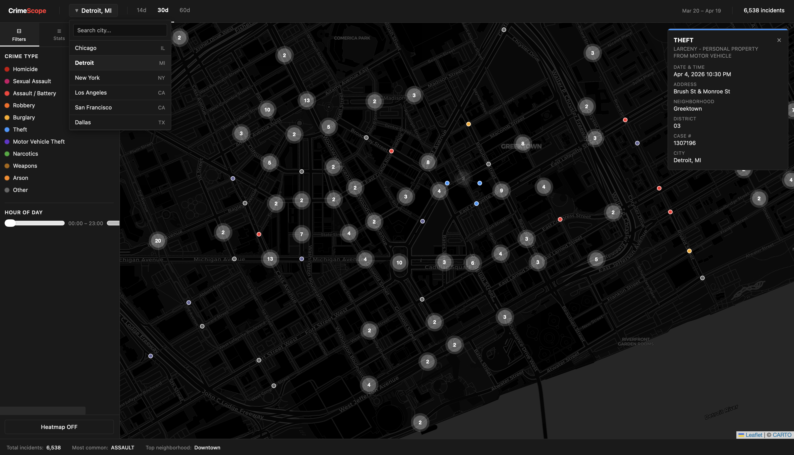

# CrimeScope

**Real-Time Crime Visualization Platform**

Search, filter, and explore live crime incident data across major U.S. cities on an interactive map.

[Explore the code »](https://github.com/LightAnd2/CrimeScope)

[View Demo](#) · [Report Bug](https://github.com/LightAnd2/CrimeScope/issues) · [Request Feature](https://github.com/LightAnd2/CrimeScope/issues)

---

## Table of Contents

- [About The Project](#about-the-project)
- [Built With](#built-with)
- [Getting Started](#getting-started)
  - [Prerequisites](#prerequisites)
  - [Installation](#installation)
- [Usage](#usage)
- [Project Structure](#project-structure)
- [Contact](#contact)
- [Acknowledgments](#acknowledgments)

---

## About The Project

CrimeScope is a front-end crime data visualization app that pulls live incident records from public city data portals and renders them on an interactive map. Switch between cities, filter by crime type and time of day, and view breakdowns by neighborhood and hour — all in a dark-themed, fast interface with no backend required.



**Why I built it**

- Public crime data exists but the city portals that host it are slow, hard to filter, and not visual
- Comparing crime patterns across cities — or understanding what a neighborhood's data actually looks like — takes too much manual work
- This project puts that data on a map with real filtering, so it's actually usable

**Features**

- Interactive Leaflet map with pin, cluster, and heatmap view modes
- Live data from Chicago, NYC, Los Angeles, San Francisco, Dallas, and Detroit
- City-aware date anchoring — portals that lag months behind auto-adjust so filters always work
- Filter by crime category and hour of day
- Sidebar with incident count, crime type breakdown chart, and neighborhood stats
- Click any incident for a detail card: type, description, address, date/time, case number
- Stale data indicator when a city portal is behind real time

---

## Built With

- [React](https://react.dev/)
- [Vite](https://vitejs.dev/)
- [Leaflet](https://leafletjs.com/) + [react-leaflet](https://react-leaflet.js.org/)
- [Zustand](https://zustand-demo.pmnd.rs/)
- [Recharts](https://recharts.org/)
- [date-fns](https://date-fns.org/)
- [Socrata SODA API](https://dev.socrata.com/) (Chicago, NYC, LA, SF, Dallas)
- [ArcGIS FeatureServer](https://developers.arcgis.com/) (Detroit)

---

## Getting Started

No backend or API key required. All data comes from free public city portals.

### Prerequisites

- Node.js 18+

### Installation

1. Clone the repository
   ```sh
   git clone https://github.com/LightAnd2/CrimeScope.git
   cd CrimeScope
   ```

2. Install dependencies
   ```sh
   npm install
   ```

3. Start the dev server
   ```sh
   npm run dev
   ```

4. Open the app
   ```
   http://localhost:5173
   ```

---

## Usage

- Select a city from the search bar in the navbar
- Use the **14d / 30d / 60d** presets to control the date window
- Toggle between **Pins**, **Clusters**, and **Heatmap** in the sidebar
- Filter incidents by crime type or drag the hour sliders to narrow by time of day
- Click any map pin to open the incident detail card
- The sidebar shows total counts, a type breakdown chart, and top neighborhoods

**Notes**

- Data freshness varies by city — NYC and LA portals run several months behind real time; the app detects this automatically and shows an orange "Data as of [date]" indicator
- Up to 50,000 records are fetched per city and filtered client-side for speed
- Detroit uses an ArcGIS endpoint; all other cities use the Socrata SODA API

---

## Project Structure

```
CrimeScope/
├── public/
├── src/
│   ├── components/
│   │   ├── CrimeDetail/       # Incident popup card
│   │   ├── Map/               # MapView, markers, heatmap, clusters
│   │   ├── Navbar/            # City search, date presets, incident count
│   │   ├── Sidebar/           # Filters, charts, summary stats
│   │   └── UI/                # Shared small components
│   ├── constants/
│   │   ├── cities.js          # City registry (endpoints, center, zoom, field mapping)
│   │   ├── crimeTypes.js      # Category definitions and colors
│   │   └── chicagoAreas.js    # Chicago community area lookup
│   ├── hooks/
│   │   ├── useCrimeData.js    # Fetch, cache, and re-filter logic
│   │   └── useMapBounds.js    # Visible bounds tracking
│   ├── services/
│   │   ├── soda.js            # Generic Socrata SODA fetcher
│   │   ├── detroit.js         # ArcGIS FeatureServer fetcher
│   │   └── chicago.js         # Chicago-specific overrides
│   ├── store/
│   │   └── crimeStore.js      # Zustand global state
│   ├── utils/
│   │   ├── normalize.js       # Raw API → standard incident shape
│   │   ├── filters.js         # Client-side filtering by date, type, hour
│   │   └── formatDate.js      # Date display helpers
│   ├── styles/
│   │   └── globals.css
│   ├── App.jsx
│   └── main.jsx
├── index.html
├── vite.config.js
├── package.json
└── .gitignore
```

---

## Contact

Andrew Koja

- GitHub: [LightAnd2](https://github.com/LightAnd2)
- LinkedIn: [linkedin.com/in/andrewkoja](https://linkedin.com/in/andrewkoja)
- Project: [github.com/LightAnd2/CrimeScope](https://github.com/LightAnd2/CrimeScope)

---

## Acknowledgments

- [Best README Template](https://github.com/othneildrew/Best-README-Template) by othneildrew
- [Leaflet](https://leafletjs.com/)
- [Chicago Data Portal](https://data.cityofchicago.org/)
- [NYC Open Data](https://opendata.cityofnewyork.us/)
- [LA Open Data](https://data.lacity.org/)
- [SF Open Data](https://data.sfgov.org/)
- [Dallas Open Data](https://www.dallasopendata.com/)
- [Detroit Open Data](https://data.detroitmi.gov/)
- [Vite](https://vitejs.dev/)
